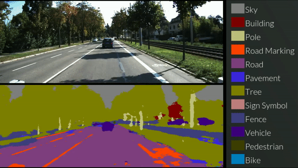
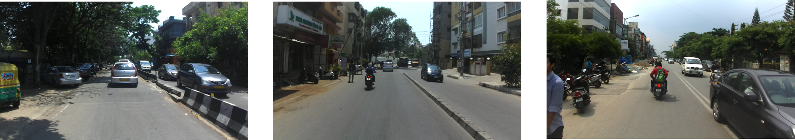
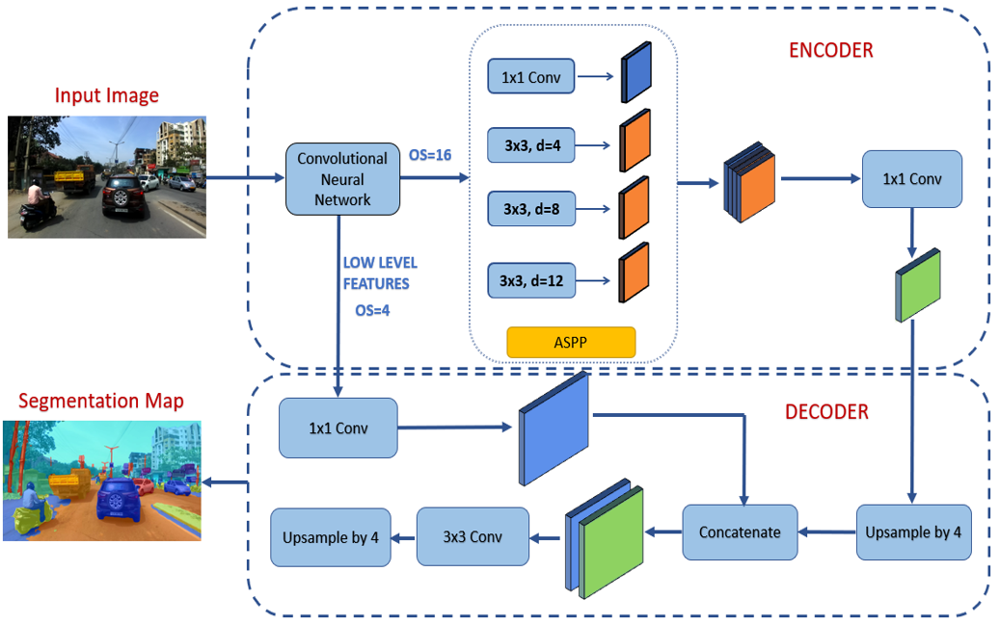
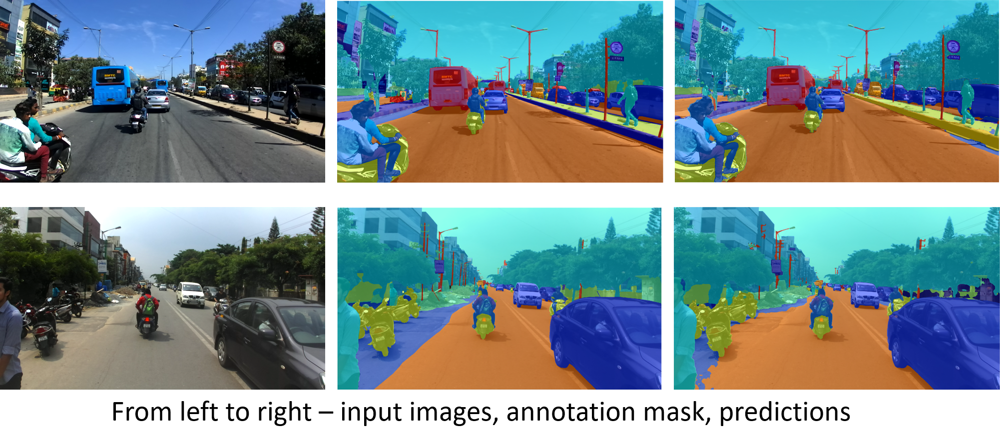

# India Driving Dataset - Semantic Segmantation Challenge

Semantic scene segmentation has become a key application in computer vision and is an essential part of intelligent transportation systems for complete scene understanding of the surrounding environment. While several methods based on deep fully Convolutional Neural Network (CNN) have been emerging, there are two main challenges: (i) They mainly focus on improvement of the accuracy than efficiency. (ii) They assume structured driving environment like in USA and Europe. While most of the current works focus on the well structured driving environment, we focus our research on India Driving Dataset (IDD) which contains data from unstructured traffic scenario.

## Architecture Approach
We design a architecture with modifications in the DeepLabV3+ framework by using lower atrous rates in Atrous Spatial Pyramid Pooling (ASPP) module for dense traffic prediction. We propose to use dilated Xception network as the backbone for feature extraction.

The performance is evaluated in terms of mean Intersection over Union (mIoU) on 26 fine grained classes of IDD. Our proposed model with 24 M parameters achieves 68.41 mIoU on test set. 
### Challenge Link
https://idd.insaan.iiit.ac.in/evaluation/icvgip20/

## Results 

## Citation
[1] Bhakti Baheti, Shubham Innani, Suhas Gajre, Sanjay Talbar, Semantic scene segmentation in unstructured environment with modified DeepLabV3+, Pattern Recognition Letters,
Volume 138, 2020, Pages 223-229, ISSN 0167-8655, https://doi.org/10.1016/j.patrec.2020.07.029. (https://www.sciencedirect.com/science/article/pii/S0167865520302750)
